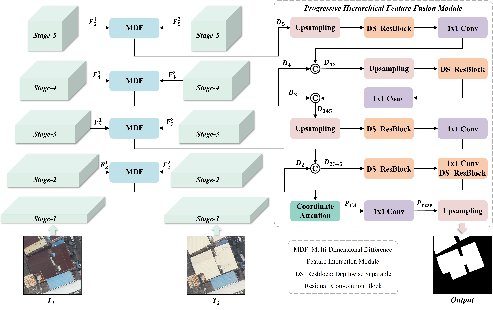

# A Novel Framework and Benchmark Dataset for Fine-Grained Urban Building Change Detection in Ultra-High-Resolution UAV Imagery
For more ore information, please see our published paper at [Geo-spatial Information Science](https://github.com/zjd1836/DIPFNet/edit/main/README.md) The official paper link will be updated once the article is published online.

# Requirements
Python 3.10  
pytorch 1.12.1  
CUDA 11.3
# DIPFNet code
DIPFNet Link: https://github.com/zjd1836/DIPFNet/blob/main/DIPFNet.py
# GZ-UAV-BCD dataset
GZ-UAV-BCD Link: https://pan.baidu.com/s/1PsR4cz-xxyNvk0AGyfdkWw?pwd=xtre Extraction Code: xtre
# Citation
If you use this code or dataset for your research, please cite our paper:  
